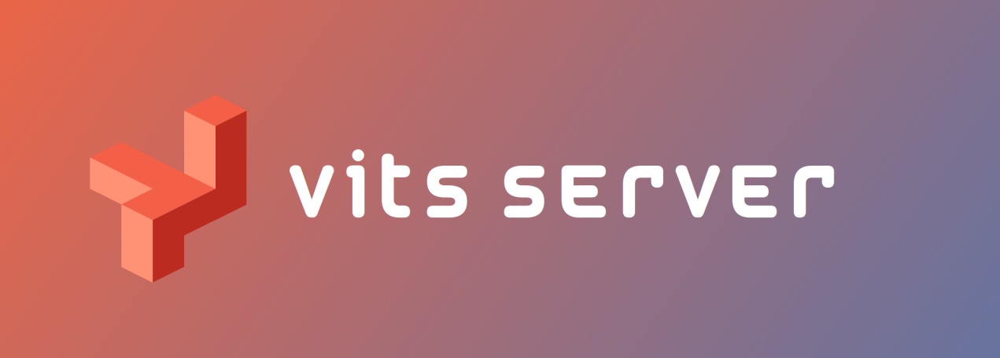

[](https://www.python.org/downloads/)
[](LICENSE)
[](https://github.com/LlmKira/VitsServer/actions/workflows/docker-latest.yaml)
------

# Vits-Server 🔥

⚡ A VITS ONNX server designed for fast inference, supporting streaming and additional inference settings to enable model
preference settings and optimize performance.

## Advantages 💪

- Automatic language type parsing for text, eliminating the need for language recognition segmentation.
- Supports multiple audio formats, including ogg, wav, flac, and silk.
- Multiple models, streaming inference.
- Additional inference settings to enable model preference settings and optimize performance.

## API Documentation 📖

We offer out-of-the-box call systems.

- [Python SDK](docs/sdk.py)
- [JavaScript SDK](docs/sdk.js)

```python
client = VITS("http://127.0.0.1:9557")
res = client.generate_voice(model_id="model_01", text="你好，世界！", speaker_id=0, audio_type="wav",
                            length_scale=1.0, noise_scale=0.5, noise_scale_w=0.5, auto_parse=True)
with open("output.wav", "wb") as f:
    for chunk in res.iter_content(chunk_size=1024):
        if chunk:
            f.write(chunk)
```

## Running 🏃

We recommend using a virtual environment to isolate the runtime environment. Because this project's dependencies may
potentially disrupt your dependency library, we recommend using `pipenv` to manage the dependency package.

### Config Server 🐚

Configuration is in `.env`, including the following fields:

```dotenv
VITS_SERVER_HOST=0.0.0.0
VITS_SERVER_PORT=9557
VITS_SERVER_RELOAD=false
```

or you can use the following command to set the environment variable:

```shell
export VITS_SERVER_HOST="0.0.0.0"
export VITS_SERVER_PORT="9557"
export VITS_SERVER_RELOAD="false"
```

`VITS_SERVER_RELOAD` means auto restart server when file changed.

### Running from pipenv 🐍

```shell
apt install python3-pip
pip3 install pipenv
pipenv install    # Create and install dependency packages
pipenv shell      # Activate the virtual environment
python3 main.py # Run

```

### Running from pm2.json 🚀

```shell
apt-get update &&
  apt-get install -y build-essential libsndfile1 vim gcc g++ cmake &&
  python3 -m pip install -r requirements.txt
apt install npm
npm install pm2 -g
pm2 start pm2.json

```

### Building from Docker 🐋

we have `docker pull sudoskys/vits-server:main` to docker hub.

you can also build from Dockerfile.

```shell
docker build -t <image-name> .
```

where `<image-name>` is the name you want to give to the image. Then, use the following command to start the container:

```shell
docker run -d -p 9557:9557 -v <local-path>/vits_model:/app/model <image-name>
```

where `<local-path>` is the local folder path you want to map to the /app/model directory in the container.

## Model Configuration 📁

In the `model` folder, place the `model.pth`/ `model.onnx` and corresponding `model.json` files. If it is `.pth`, it
will be automatically converted to `.onnx`!

`model` folder structure:

```
.
├── 1000_epochs.json
├── 1000_epochs.onnx
├── 1000_epochs.pth
├── 233_epochs.json
├── 233_epochs.onnx
└── 233_epochs.pth
```

`Model ID` is `1000_epochs` and `233_epochs`.

### Model Extension Design 🔍

You can add extra fields in the model configuration to obtain information such as the model name corresponding to the
model ID through the API.

```json5
{
  //...
  "info": {
    "name": "coco",
    "description": "a vits model",
    "author": "someone",
    "cover": "https://xxx.com/xxx.jpg",
    "email": "xx@ws.com"
  },
  "infer": {
    "noise_scale": 0.667,
    "length_scale": 1.0,
    "noise_scale_w": 0.8
  }
  //....
}
```

### How can I retrieve model information?

You can access f"{self.base_url}/model/list?show_speaker=True&show_ms_config=True" to obtain detailed information about
model roles and configurations.

## TODO 📝

- [ ] Test Silk format
- [ ] Docker for automatic deployment
- [ ] Shell script for automatic deployment

## Acknowledgements 🙏

We would like to acknowledge the contributions of the following projects in the development of this project:

- MoeGoe: https://github.com/CjangCjengh/MoeGoe
- vits_with_chatbot: https://huggingface.co/Mahiruoshi/vits_with_chatbot
- vits: https://huggingface.co/spaces/Plachta/VITS-Umamusume-voice-synthesizer
- espnet: https://github.com/espnet/espnet_onnx
- onnxruntime: https://onnxruntime.ai/
